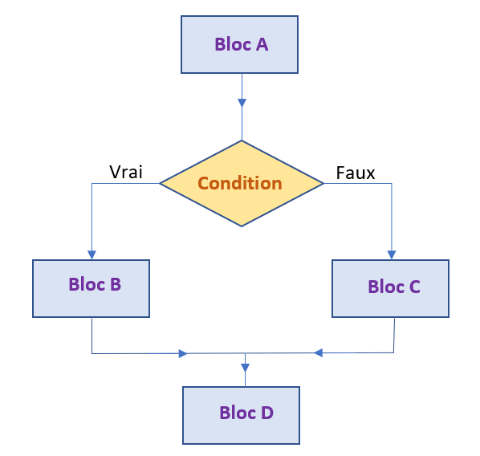

Jusqu'a maintenant nous nous somme contenter de faire des calcule mathématiques simples, mais nous n'avons pas encore fait d'algorithmie.
Or, pour résoudre un problème informatique, il faut toujours effectuer une série d'actions dans un certain ordre. La description structurée de ces actions et de l'ordre dans lequel il convient de les effectuer s'appelle un algorithme
Nous allons donc ici apprendre à contrôlez le déroulement de votre programme avec des conditions

# Le déroulement d'un programme

Le déroulement du programme est l’ordre dans lequel les lignes de code sont exécutées. Certaines lignes seront lues une fois seulement, d’autres plusieurs fois. D’autres encore pourraient être complètement ignorées, tout dépend de la façon dont vous les avez codées.

Les instructions conditionnelles sont un moyen de contrôler la logique et le déroulement de votre code avec des conditions.
Elles sont les briques de bases d'un programme, et permettent en fonction du résultat de l'evaluation d'une expréssion booléennes, d'executer une certaine portion de code plutot qu'une autre.

## Les instructions conditionnelles

Vous en avez déjà tous fait sans le savoir. Il s'agit simplement de prendre une décision en fonction de paramétre:
Si on à le temps alors j'irai faire du sport
Si j'ai des bonnes notes alors j'aurai une SWITCH pour noel
Si je fait les exercices du cours alors j'arriverait facilement à coder sinon je vais galerer

Tout ces phrases on une chose en commun: une instruction conditionnelles **SI**

La condtionnelle est une structure qui permet d'exécuter du code selon qu'une condition est remplie ou non.
Elle sera de la forme:

```
if condition:
  bloc A
```
Le bloc A ne sera exécuter que si la condition est remplie:

Petit point syntaxe:
Python est très sensible à l'indentation (le nombre de caractére espace et retour à la ligne)
une Séquences d'instructions, toutes indentées du même nombre d'espaces est appelée un bloc.C'est ainsi que le langage python différencie la séquence d'instruction à éffectuer quand la condition est remplie.

```
if condition :
  blocA
  blocA
  blocA
blocB
blocB

```
Analyser bien la syntaxe: la condition commence par un l'instruction **IF** suivie de la condition suivie de **:** puis d'un retours à la lignes
le bloc commence par une **indentation**

```
if condition:
bloc A
```
Ceci renveras une erreur de syntaxe (syntax error) (retenez ce message d'erreur vous le verez souvent ;)


```python runnable
if 1+1 == 2 :
  print("c'est vrai")

if 1+1 > 2 :
    print(c'est faux donc se message ne s'affichera pas)
```

A cela on peut rajouter bloc **else** qui sera exécuter si la condition **if** n'est pas remplie

```
if condition:
  bloc A
else:
  bloc B
```
dans cette extrait soit le code A sera exécuter soit le code B **mais jamais les deux**
else se traduit par **sinon**:
soit j'execute le blocA sinon j'exécute le bloc B.

```python runnable
if 1+1 > 2 :
    print(c'est faux donc se message ne s'affichera pas)
else:
    print("du coup c'est ce message qui s'affiche")
```

plusieur tests peuvent être enchainé grace au mot clés **elif** (qui est l'abrevation de else if)

```
if condition A:
  bloc A
elif conditionB:
  bloc B
elif conditionC:
  bloc C
else:
  bloc D
```

Attention cependant à l'ordre des elif car **un seul bloc sera exécuter**: celui de la premiere condition remplie.

## condition imbriqué:
Ce n'est pas bien compliqué il s'agit simplement d'une instructions conditionnelles dans une autre instructions conditionnelles:
Voyez plutôt:
```
if condition A:
  if conditionAA:
    bloc AA
  else:
    bloc AB  
else:
  bloc B
```

ici le bloc AA sera executé si la condition A est rempli et la condition AA
Si la condition A est rempli mais pas la condition AA alors le bloc AB sera exécuter.
Si la condition A n'est pas rempli alors le bloc B est exécuter (la condition AA n'est même pas tester).


## retour sur les opérateurs
 Il est important de bien comprendre le fonctionnement des opérateurs et des instruction conditionnelles car cela représente 80% de votre future travail de développeur

 **Les opérateurs logiques**

 | Instruction python | Signification |
| ------ | ----------- |
| a == b   | a est égal à b |
| a > b | a est strictement supérieure à b |
| a >= b | a est supérieure ou égale à b |
| a != b | a est différent de b |
| a<b and b>c| a est inférieure à b ET b et supérieure à c |
| a<b or b>c| a est inférieure à b OU b et supérieure à c |
| a<b ^ b>c| a est inférieure à b (OU exclusif) b et supérieure à c |
| not(True) | le contraire de True |

le **XOR** (ou exclusif) signie l'un ou l'autre mais pas les deux

à cela on peut rajoute quelques opérateur sur les chaines de caractére
| "a" == "A"   | vaut False |
| "on" in "bon" | Vaut True |
| "on" not in "bon" | Vaut False |


 l'opérateur **in** permet de teste l'appartenance d'une chaine à une autre (si celle-ci est présente dans l'autre)


faire des exercices sur les instruction 



Si on regarde l'automate ci-dessus
Voyons comment ce type de logique fonctionne dans le code.
