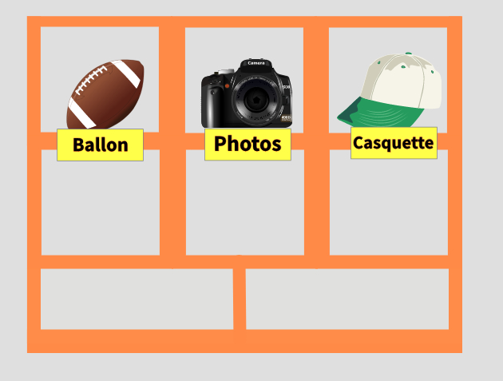

# Les variables

Peut importe le langage de programmation utiliser, il existe un point commun entre eux: l'utilisation de variable!

### Commençons par une analogie
Vous venez d'aménager dans votre nouvelle maison,et souhaitez avoir une chambre parfaitement ranger (le rêve de tout parent).
Pour cela vous avez acheter une superbe étagere à case!! Dans chaque case vous allez pouvoir y ranger des affaires.


<div class="alert alert-block alert-info">
  C'est normal que toutes les cases ne soit pas de la même tailles?
  Oui, car toutes les affaires ne sont pas de la même taille. Mais on y reviendra plus tard
</div>


Comme vous est quelqu'un d'extrémement organiser vous aller étiqueter chaque case pour que l'on sache ce qu'il y à dedans.



Une **variable** en informatique est une peux comme une case de notre étagere.
Elle nous permet de stocker une donnée et d'y attribuer une étiquette.

En python elle se déclare ainsi:

```python runnable
Ma_variable = 10
#Attention de ne pas confondre = et == l'operateur de comparaison
```
<div class="alert alert-block alert-info">
En informatique nous utilisont les terme "déclarere" une variable pour dire que nous avons *crée* une variable
</div>


 #### Analyson un peu plus en détail cette déclaration:

 Ma ligne de code commence par Ma_Variable. Il s'agit du label (dans notre analogie il s'agit de l'étiquette).
 C'est le nom que nous utiliseront dans la suite du programme pour faire référence au contenue de notre case.

 <div class="alert alert-block alert-warning">
La casse (le faite de mettre des minuscule et des majuscule) est extremement importante. <i> MaVariable </i> est different de <i>mavariable</i>

 </div>


Maintenant analyson la partie droite: la valeur 10.
Il s'agit simplement de la valeur que nous allon affecter à notre variable (dans notre analogie il s'agit des affaires que nous mettons dans notre case).

Désormais lorsque je souhaite utiliser la valeur 10 dans mon programme je peut utiliser ma variable : Ma_variable

<div class="alert alert-block alert-warning">
C'est pas hyper pratique, pourquoi ne pas simplement utiliser directement la valeur 10 plutôt qu'une variable?
</div>
Pour l'instant et pour cette exemple c'est pas faux. Mais très vite nous allons voire l'utiliter de labeliser des valeurs.

#### Déclaration multiple
Déclarer des variables est quelques chose de très fréquent dans un programme. C'est pourquoi en python il existe différentes syntaxe pour gagner du temps.

```python runnable
A = 10
B = 4
C = 25600
```
Peut s’écrire plus rapidement:

```python runnable
A,B,C = 10,4,25600
print(A)
print(B)
print(C)
```

/!\ Dans ce cas , faite attention de ne pas vous tromper dans l'ordre de Déclaration

A,B,C = 10,4,25600 sera différent de A,C,B = 10,4,25600


### Modifier le contenue d'une variable
Bon il est temps de rentré dans le vif du sujet. L'interet majeur de déclarer une variable est de pouvoir y modifier sont contenue.
Il est effectivement possible de modifier le contenu d'une variable déjà déclarer.

```python runnable
A = 10
A = 20
print(A)
```
Dans cette exemple nous nous somme contenter de modifier le contenue de notre variable A. Nous avons donc retiré de notre case la valeur 10 pour y stocker la valeur 20 (nous avons simplement remplacer le contenu d'une case sans modifier sont etiquette.C'est comme remplacer une casquette par une autre).

```python runnable
A = 10
A = A*2
print(A)
```
Ici c'est un poil plus complexe: Nous avons modifier le contenue de notre variable A avec la valeur de la variable A!!
Détaillons ce que va faire l'ordinateur exactement:
L'ordinateur va lire la 1er instruction <i>A = </i> (il comprend donc qu'il va devoir modifier la valeur de la case,mais pour l'instant il ne fait rien)
ensuite il analyse ```A*2``` autrement dit _valeur de la  case A *2_ a cette étape la case A n'a pas encore été modifier, elle vos donc toujours 10. l'ordinateur remplace donc
l'instruction _A*2_  par _10*2_ , ce qui donnera l'instruction une fois analyser _A = 20_


<div class="alert alert-block alert-warning">
Modifier une variable est une chose très fréquente. Notamment l'incrémentation d'un indice, c'est pourquoi il existe une syntaxe un peut plus rapide:
```python
A += 1
#équivaux à
A = A +1
```

Cette syntaxe est valable pour tout les operateur (+-*/)
</div>
